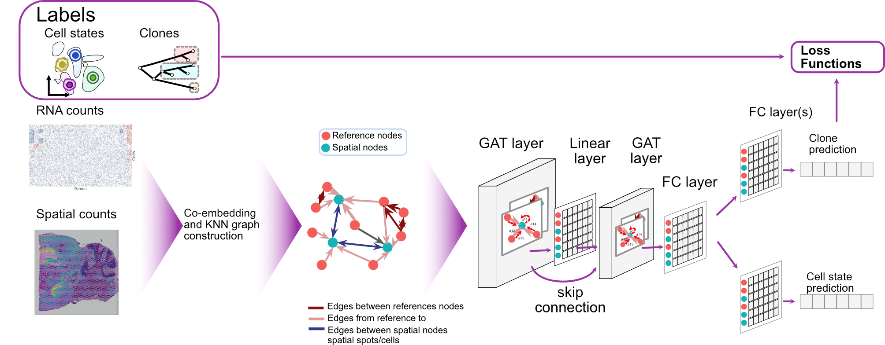

<div style="text-align: center;">
  
</div>

SpaceTree: Deciphering Tumor Microenvironments by joint modeling of cell states and genotype-phenotype relationships in spatial omics data 
==============================

SpaceTree jointly models spatially smooth cell type- and clonal state composition.
SpaceTree employs Graph Attention mechanisms, capturing information from spatially close regions when reference mapping falls short, enhancing both interpretation and quantitative accuracy. 

A significant merit of SpaceTree is its technology-agnostic nature, allowing clone-mapping in sequencing- and imaging-based assays. 
The model outputs can be used to characterize spatial niches that have consistent cell type and clone composition.


<div style="text-align: center;">
  
</div>
Overview of the spatial mapping approach and the workflow enabled by spaceTree.From left to right: spaceTree requirs as input reference (scRNA-seq) and spatial count matrices as well as labels that need to be transfered. The labels can be descrete, continious or hierachical. The model outputs a spatial mapping of the labels and the cell type (compositions in case of Visium) of the spatial regions.

## Usage and Tutorials


### Installation
Create conda environment and install dependencies:

```bash
conda create -y -n spacetree_env python=3.9
conda activate spacetree_env
# cd in the spaceTree directory
cd spaceTree
conda activate spacetree_env
pip install .
```
Finally, to use this environment in jupyter notebook, add jupyter kernel for this environment:


```bash
conda activate spacetree_env
python -m ipykernel install --user --name=spacetree_env --display-name='spacetree_env'
```

### Documentation, Tutorials and Examples
Check out our tutorials and documentation to get started with spaceTree [here](https://pmbio.github.io/spaceTree/).

## Citation
