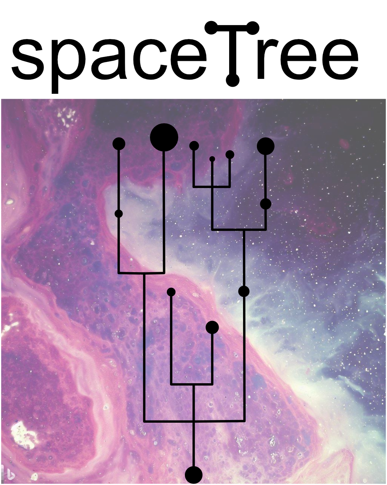

<div style="text-align: left;">
  
</div>

Welcome to the official documentation for spaceTree! Here, you will find tutorials and guides to help you get started and make the most out of our tool.

### Installation
Create conda environment and install dependencies:

```bash
conda create -y -n spacetree_env python=3.9
# cd in the spaceTree directory
cd spaceTree
conda activate spacetree_env
pip install .
```
Finally, to use this environment in jupyter notebook, add jupyter kernel for this environment:


```bash
conda activate spacetree_env
python -m ipykernel install --user --name=spacetree_env --display-name='spacetree_env'
```

### Tutorials 
spaceTree is a versatile tool that can be used in a variety of applications. It works with both sequencing and imaging-based assays. The main difference in tutorials is the way spatial graph needs to be constructed. For technologies that are based on a grid (like Visium ST/HD) we rely on the grid for the graph construction. For technologies like Xenium, we compute the spatial similarity graph based on the spatial coordinates of the cells.

To understand the workflow please refer to our end-to-end tutorials.

For Visium/grid-based data:

- [Cell state and clone mapping to 10x Visium with spaceTree](tutorials/cell-state-clone-mapping.md)

For Xenium data, please refer to:
- [Cell state and clone mapping to 10x Xenium with spaceTree](tutorials/cell-state-clone-mapping-xenium.md)

If you need help defining clones based on your own scRNA-seq data, you can use tools such as [inferCNV](https://github.com/broadinstitute/inferCNV/wiki), [inferCNVpy](https://infercnvpy.readthedocs.io/en/latest/tutorials.html), [copyKAT](https://github.com/navinlabcode/copykat) and others.

For the sake of the Visium and Xenium tutorials, we also show how we ran the clone inference based on inferCNVpy [here](https://github.com/PMBio/spaceTree/blob/master/notebooks/infercnv_run.ipynb)
