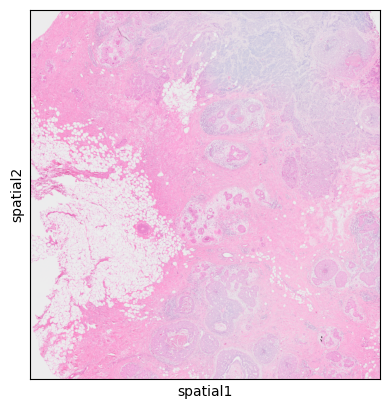
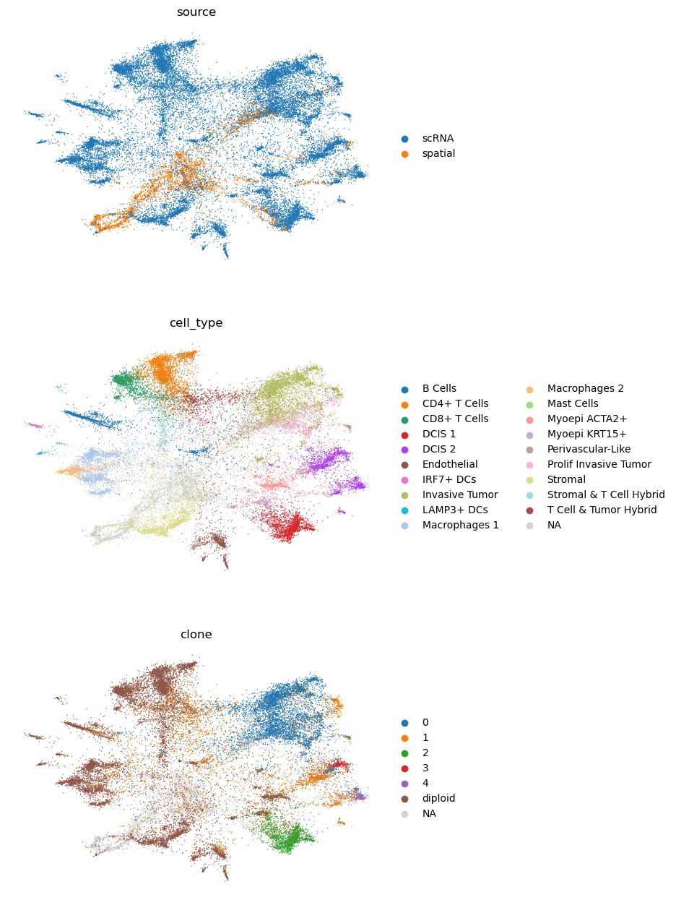

# Cell State and Clone Mapping to 10x Visium with spaceTree

This tutorial is based on public data from Janesick et al. 2023: [High resolution mapping of the tumor microenvironment using integrated single-cell, spatial and in situ analysis](https://www.nature.com/articles/s41467-023-43458-x).

In particular, we will use the following files:

- Visium files:
    - Visium HDF5 file 
    - Visium image files
- FRP (scRNA) HDF5 file
- Annotation files:

    - Cell Type annotation file
    - Clone annotation file (based on [infercnvpy](https://github.com/icbi-lab/infercnvpy) run on FRP data) (provided in the `data` folder). We also provide a [tutorial](https://github.com/PMBio/spaceTree/blob/master/notebooks/infercnv_run.ipynb) on how to generate this file.

All data should be downloaded and placed in the `data` folder. You should download the data using the following commands:

```bash
cd data/
# annotation file
wget https://cdn.10xgenomics.com/raw/upload/v1695234604/Xenium%20Preview%20Data/Cell_Barcode_Type_Matrices.xlsx
# scFFPE data
wget https://cf.10xgenomics.com/samples/spatial-exp/2.0.0/CytAssist_FFPE_Human_Breast_Cancer/CytAssist_FFPE_Human_Breast_Cancer_filtered_feature_bc_matrix.h5
# Visium counts data
wget https://cf.10xgenomics.com/samples/cell-exp/7.0.1/Chromium_FFPE_Human_Breast_Cancer_Chromium_FFPE_Human_Breast_Cancer/Chromium_FFPE_Human_Breast_Cancer_Chromium_FFPE_Human_Breast_Cancer_count_sample_filtered_feature_bc_matrix.h5
# Visium spatial data
wget https://cf.10xgenomics.com/samples/spatial-exp/2.0.0/CytAssist_FFPE_Human_Breast_Cancer/CytAssist_FFPE_Human_Breast_Cancer_spatial.tar.gz
# decompressing spatial data
tar -xvzf CytAssist_FFPE_Human_Breast_Cancer_spatial.tar.gz
# renaming tissue_positions file to make it compatable with scanpy
mv spatial/tissue_positions.csv spatial/tissue_positions_list.csv

```


# 0: Imports


```python
import scanpy as sc
import pandas as pd
import matplotlib.pyplot as plt
import seaborn as sns
import numpy as np
from sklearn.neighbors import kneighbors_graph
from tqdm import tqdm
from scipy.spatial import distance
import scvi
from scvi.model.utils import mde
import os
import spaceTree.preprocessing as pp
import spaceTree.dataset as dataset
import warnings
warnings.simplefilter("ignore")
```

    /data/olga/anaconda3/envs/torch_gnn/lib/python3.10/site-packages/scvi/_settings.py:63: UserWarning: Since v1.0.0, scvi-tools no longer uses a random seed by default. Run `scvi.settings.seed = 0` to reproduce results from previous versions.
      self.seed = seed
    /data/olga/anaconda3/envs/torch_gnn/lib/python3.10/site-packages/scvi/_settings.py:70: UserWarning: Setting `dl_pin_memory_gpu_training` is deprecated in v1.0 and will be removed in v1.1. Please pass in `pin_memory` to the data loaders instead.
      self.dl_pin_memory_gpu_training = (
    /data/olga/anaconda3/envs/torch_gnn/lib/python3.10/site-packages/tqdm/auto.py:21: TqdmWarning: IProgress not found. Please update jupyter and ipywidgets. See https://ipywidgets.readthedocs.io/en/stable/user_install.html
      from .autonotebook import tqdm as notebook_tqdm
    /data/olga/anaconda3/envs/torch_gnn/lib/python3.10/site-packages/flax/struct.py:132: FutureWarning: jax.tree_util.register_keypaths is deprecated, and will be removed in a future release. Please use `register_pytree_with_keys()` instead.
      jax.tree_util.register_keypaths(data_clz, keypaths)
    /data/olga/anaconda3/envs/torch_gnn/lib/python3.10/site-packages/flax/struct.py:132: FutureWarning: jax.tree_util.register_keypaths is deprecated, and will be removed in a future release. Please use `register_pytree_with_keys()` instead.
      jax.tree_util.register_keypaths(data_clz, keypaths)


# 1: Open data files

## 1.1 RNA data and annotations


```python
adata_ref = sc.read_10x_h5('../data/Chromium_FFPE_Human_Breast_Cancer_Chromium_FFPE_Human_Breast_Cancer_count_sample_filtered_feature_bc_matrix.h5')
adata_ref.var_names_make_unique()
cell_type = pd.read_excel("../data/Cell_Barcode_Type_Matrices.xlsx", sheet_name="scFFPE-Seq", index_col = 0)
clone_anno = pd.read_csv("../data/clone_annotation.csv", index_col = 0)
```


```python
adata_ref.obs = adata_ref.obs.join(cell_type, how="left").join(clone_anno, how="left")
```


```python
adata_ref.obs.columns = ['cell_type', 'clone']
adata_ref = adata_ref[~adata_ref.obs.cell_type.isna()]
```

## Visium data


```python
visium = sc.read_visium("../data/", 
                        count_file='CytAssist_FFPE_Human_Breast_Cancer_filtered_feature_bc_matrix.h5')
visium.var_names_make_unique()
visium = pp.convert_array_row_col_to_int(visium)
```


```python
sc.pl.spatial(visium)
```


    

    


# 1: Run scvi to remove batch effects and prepare data for knn-graph construction


```python
visium.obs["source"] = "spatial"
adata_ref.obs["source"] = "scRNA"
adata = visium.concatenate(adata_ref)
cell_source = pp.run_scvi(adata, "../data/res_scvi.csv", plot_extra = ["cell_type", "clone"])
```

    GPU available: True (cuda), used: True
    TPU available: False, using: 0 TPU cores
    IPU available: False, using: 0 IPUs
    HPU available: False, using: 0 HPUs
    You are using a CUDA device ('NVIDIA GeForce RTX 4090') that has Tensor Cores. To properly utilize them, you should set `torch.set_float32_matmul_precision('medium' | 'high')` which will trade-off precision for performance. For more details, read https://pytorch.org/docs/stable/generated/torch.set_float32_matmul_precision.html#torch.set_float32_matmul_precision
    LOCAL_RANK: 0 - CUDA_VISIBLE_DEVICES: [1]


    Epoch 247/247: 100%|██████████| 247/247 [06:26<00:00,  1.42s/it, v_num=1, train_loss_step=7.95e+3, train_loss_epoch=8.09e+3]

    `Trainer.fit` stopped: `max_epochs=247` reached.


    Epoch 247/247: 100%|██████████| 247/247 [06:26<00:00,  1.57s/it, v_num=1, train_loss_step=7.95e+3, train_loss_epoch=8.09e+3]


    

    


```python
#
```
