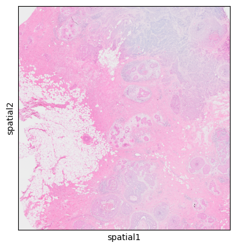
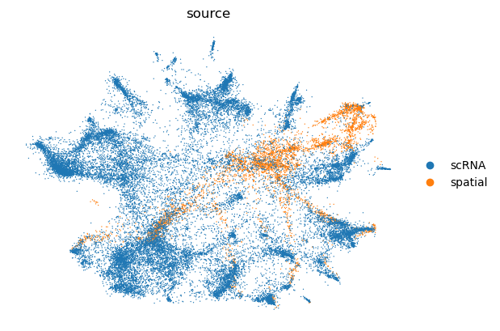
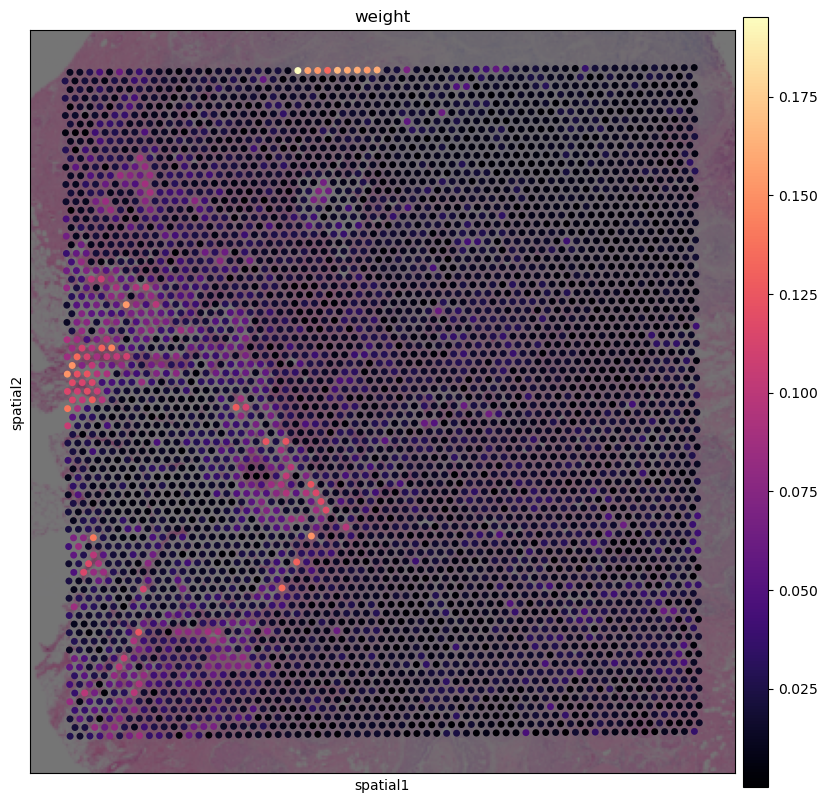
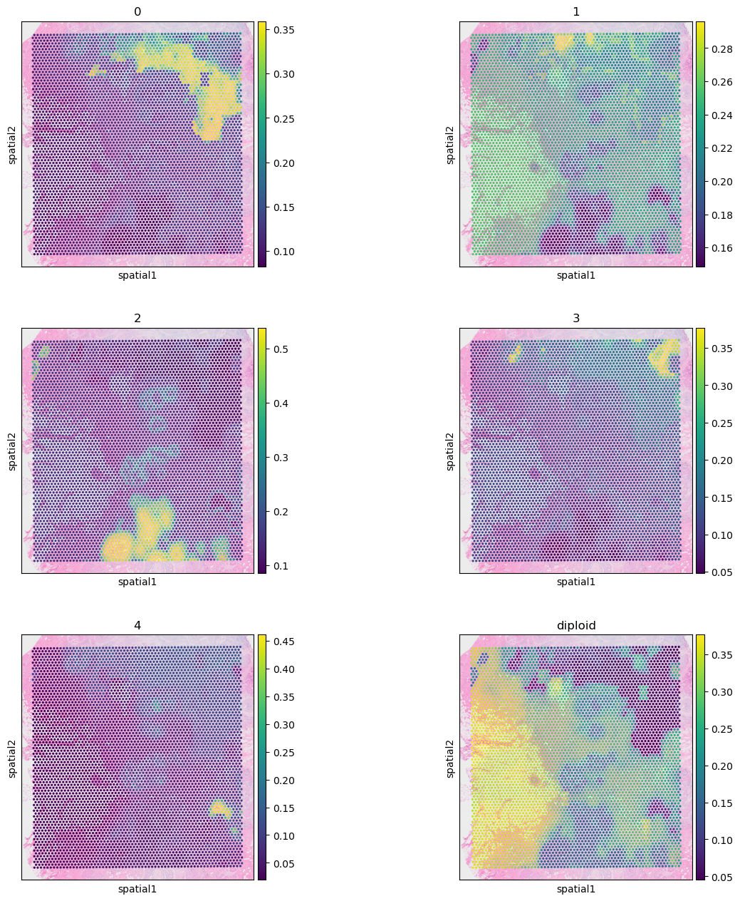

# Cell State and Clone Mapping to 10x Visium with spaceTree

This tutorial is based on public data from Janesick et al. 2023: [High resolution mapping of the tumor microenvironment using integrated single-cell, spatial and in situ analysis](https://www.nature.com/articles/s41467-023-43458-x).

In particular, we will use the following files:

- Visium files:
    - Visium HDF5 file 
    - Visium image files
- FRP (scRNA) HDF5 file
- Annotation files:

    - Cell Type annotation file
    - Clone annotation file (based on [infercnvpy](https://github.com/icbi-lab/infercnvpy) run on FRP data) (provided in the `data` folder). We also provide a [tutorial](https://github.com/PMBio/spaceTree/blob/master/notebooks/infercnv_run.ipynb) on how to generate this file.

All data should be downloaded and placed in the `data` folder. You should download the data using the following commands:

```bash
cd data/
# annotation file
wget https://cdn.10xgenomics.com/raw/upload/v1695234604/Xenium%20Preview%20Data/Cell_Barcode_Type_Matrices.xlsx
# scFFPE data
wget https://cf.10xgenomics.com/samples/spatial-exp/2.0.0/CytAssist_FFPE_Human_Breast_Cancer/CytAssist_FFPE_Human_Breast_Cancer_filtered_feature_bc_matrix.h5
# Visium counts data
wget https://cf.10xgenomics.com/samples/cell-exp/7.0.1/Chromium_FFPE_Human_Breast_Cancer_Chromium_FFPE_Human_Breast_Cancer/Chromium_FFPE_Human_Breast_Cancer_Chromium_FFPE_Human_Breast_Cancer_count_sample_filtered_feature_bc_matrix.h5
# Visium spatial data
wget https://cf.10xgenomics.com/samples/spatial-exp/2.0.0/CytAssist_FFPE_Human_Breast_Cancer/CytAssist_FFPE_Human_Breast_Cancer_spatial.tar.gz
# decompressing spatial data
tar -xvzf CytAssist_FFPE_Human_Breast_Cancer_spatial.tar.gz
# renaming tissue_positions file to make it compatable with scanpy
mv spatial/tissue_positions.csv spatial/tissue_positions_list.csv

```


## 0: Imports


```python
import scanpy as sc
import pandas as pd
import matplotlib.pyplot as plt
import seaborn as sns
import numpy as np
from sklearn.neighbors import kneighbors_graph
from tqdm import tqdm
from scipy.spatial import distance
import scvi
from scvi.model.utils import mde
import os
import spaceTree.preprocessing as pp
import spaceTree.dataset as dataset
import warnings
import re
import pickle
import torch
from torch_geometric.loader import DataLoader,NeighborLoader
import torch.nn.functional as F
import lightning.pytorch as pl
import spaceTree.utils as utils
from spaceTree.models import *
warnings.simplefilter("ignore")
```

## 1: Prepare the data for spaceTree

### 1.1: Open data files


```python
adata_ref = sc.read_10x_h5('../data/Chromium_FFPE_Human_Breast_Cancer_Chromium_FFPE_Human_Breast_Cancer_count_sample_filtered_feature_bc_matrix.h5')
adata_ref.var_names_make_unique()
cell_type = pd.read_excel("../data/Cell_Barcode_Type_Matrices.xlsx", sheet_name="scFFPE-Seq", index_col = 0)
clone_anno = pd.read_csv("../data/clone_annotation.csv", index_col = 0)
```


```python
adata_ref.obs = adata_ref.obs.join(cell_type, how="left").join(clone_anno, how="left")
```


```python
adata_ref.obs.columns = ['cell_type', 'clone']
adata_ref = adata_ref[~adata_ref.obs.cell_type.isna()]
```


```python
visium = sc.read_visium("../data/", 
                        count_file='CytAssist_FFPE_Human_Breast_Cancer_filtered_feature_bc_matrix.h5')
visium.var_names_make_unique()
visium = pp.convert_array_row_col_to_int(visium)
```


```python
sc.pl.spatial(visium)
```


    

    


### 1.2: Run scvi to remove batch effects and prepare data for knn-graph construction


```python
visium.obs["source"] = "spatial"
adata_ref.obs["source"] = "scRNA"
adata = visium.concatenate(adata_ref)
cell_source = pp.run_scvi(adata, "../data/res_scvi.csv")
```

    GPU available: True (cuda), used: True
    TPU available: False, using: 0 TPU cores
    IPU available: False, using: 0 IPUs
    HPU available: False, using: 0 HPUs
    LOCAL_RANK: 0 - CUDA_VISIBLE_DEVICES: [1]


    Epoch 247/247: 100%|██████████| 247/247 [06:23<00:00,  1.46s/it, v_num=1, train_loss_step=8.42e+3, train_loss_epoch=8.08e+3]

    `Trainer.fit` stopped: `max_epochs=247` reached.


    Epoch 247/247: 100%|██████████| 247/247 [06:23<00:00,  1.55s/it, v_num=1, train_loss_step=8.42e+3, train_loss_epoch=8.08e+3]


    

    


```python
cell_source.head()
```


<div>
<style scoped>
    .dataframe tbody tr th:only-of-type {
        vertical-align: middle;
    }

    .dataframe tbody tr th {
        vertical-align: top;
    }

    .dataframe thead th {
        text-align: right;
    }
</style>
<table border="1" class="dataframe">
  <thead>
    <tr style="text-align: right;">
      <th></th>
      <th>0</th>
      <th>1</th>
      <th>source</th>
    </tr>
  </thead>
  <tbody>
    <tr>
      <th>AACACCTACTATCGAA-1-0</th>
      <td>1.525705</td>
      <td>0.691050</td>
      <td>spatial</td>
    </tr>
    <tr>
      <th>AACACGTGCATCGCAC-1-0</th>
      <td>0.806706</td>
      <td>0.244148</td>
      <td>spatial</td>
    </tr>
    <tr>
      <th>AACACTTGGCAAGGAA-1-0</th>
      <td>0.953750</td>
      <td>-0.675919</td>
      <td>spatial</td>
    </tr>
    <tr>
      <th>AACAGGAAGAGCATAG-1-0</th>
      <td>0.539141</td>
      <td>0.319413</td>
      <td>spatial</td>
    </tr>
    <tr>
      <th>AACAGGATTCATAGTT-1-0</th>
      <td>0.762749</td>
      <td>0.381386</td>
      <td>spatial</td>
    </tr>
  </tbody>
</table>
</div>


### 1.3: Construct the knn-graphs


```python
# get rid of the number in the end of the index
cell_source.index = [re.sub(r'-(\d+).*', r'-\1', s) for s in cell_source.index]
emb_spatial =cell_source[cell_source.source == "spatial"][[0,1]]
emb_rna = cell_source[cell_source.source == "scRNA"][[0,1]]
```


```python
cell_source.head()
```


<div>
<style scoped>
    .dataframe tbody tr th:only-of-type {
        vertical-align: middle;
    }

    .dataframe tbody tr th {
        vertical-align: top;
    }

    .dataframe thead th {
        text-align: right;
    }
</style>
<table border="1" class="dataframe">
  <thead>
    <tr style="text-align: right;">
      <th></th>
      <th>0</th>
      <th>1</th>
      <th>source</th>
    </tr>
  </thead>
  <tbody>
    <tr>
      <th>AACACCTACTATCGAA-1</th>
      <td>1.525705</td>
      <td>0.691050</td>
      <td>spatial</td>
    </tr>
    <tr>
      <th>AACACGTGCATCGCAC-1</th>
      <td>0.806706</td>
      <td>0.244148</td>
      <td>spatial</td>
    </tr>
    <tr>
      <th>AACACTTGGCAAGGAA-1</th>
      <td>0.953750</td>
      <td>-0.675919</td>
      <td>spatial</td>
    </tr>
    <tr>
      <th>AACAGGAAGAGCATAG-1</th>
      <td>0.539141</td>
      <td>0.319413</td>
      <td>spatial</td>
    </tr>
    <tr>
      <th>AACAGGATTCATAGTT-1</th>
      <td>0.762749</td>
      <td>0.381386</td>
      <td>spatial</td>
    </tr>
  </tbody>
</table>
</div>


```python
visium.obs = visium.obs.drop(columns=["weight"])
```


```python
print("1. Recording edges between RNA and spatial embeddings...")
# 10 here is the number of neighbors to be considered
edges_sc2vis = pp.record_edges(emb_spatial, emb_rna,10, "sc2vis")
# checking where we have the highest distance to refrence data as those might be potentially problematic spots for mapping
pp.show_weights_distribution(edges_sc2vis,visium, 'visium')
edges_sc2vis = pp.normalize_edge_weights(edges_sc2vis)
#%%
print("2. Recording edges between RNA embeddings...")
# 10 here is the number of neighbors to be considered
edges_sc2sc = pp.record_edges(emb_rna,emb_rna, 10, "sc2sc")
edges_sc2sc = pp.normalize_edge_weights(edges_sc2sc)

#%%
print("3. Creating edges for Visium nodes...")
edges_vis2grid = pp.create_edges_for_visium_nodes(visium)
#%%
print("4. Saving edges and embeddings...")
edges = pd.concat([edges_sc2vis, edges_sc2sc, edges_vis2grid])
edges.node1 = edges.node1.astype(str)
edges.node2 = edges.node2.astype(str)

pp.save_edges_and_embeddings(edges, emb_spatial, emb_rna, outdir ="../data/tmp/")
```

    1. Recording edges between RNA and spatial embeddings...


    

    


    2. Recording edges between RNA embeddings...
    3. Creating edges for Visium nodes...


    100%|██████████| 4992/4992 [00:09<00:00, 540.17it/s]


    4. Saving edges and embeddings...


```python
edges.head()
```


<div>
<style scoped>
    .dataframe tbody tr th:only-of-type {
        vertical-align: middle;
    }

    .dataframe tbody tr th {
        vertical-align: top;
    }

    .dataframe thead th {
        text-align: right;
    }
</style>
<table border="1" class="dataframe">
  <thead>
    <tr style="text-align: right;">
      <th></th>
      <th>node1</th>
      <th>node2</th>
      <th>weight</th>
      <th>type</th>
    </tr>
  </thead>
  <tbody>
    <tr>
      <th>0</th>
      <td>TGAGCGATCACTAATC-1</td>
      <td>AACACCTACTATCGAA-1</td>
      <td>0.909754</td>
      <td>sc2vis</td>
    </tr>
    <tr>
      <th>1</th>
      <td>GATCGATAGGAAGGTA-1</td>
      <td>AACACCTACTATCGAA-1</td>
      <td>0.909715</td>
      <td>sc2vis</td>
    </tr>
    <tr>
      <th>2</th>
      <td>CAGTATTTCGGCTAGA-1</td>
      <td>AACACCTACTATCGAA-1</td>
      <td>0.887354</td>
      <td>sc2vis</td>
    </tr>
    <tr>
      <th>3</th>
      <td>AAGGCTTAGTGCCCTG-1</td>
      <td>AACACCTACTATCGAA-1</td>
      <td>0.860617</td>
      <td>sc2vis</td>
    </tr>
    <tr>
      <th>4</th>
      <td>CCCTTCGGTGACACAA-1</td>
      <td>AACACCTACTATCGAA-1</td>
      <td>0.857889</td>
      <td>sc2vis</td>
    </tr>
  </tbody>
</table>
</div>


Make sure that we have 3 types of edges:
- single-cell (reference) to visium `sc2vis`
- visium to visium `vis2grid`
- single-cell (reference) to single-cell (reference) `sc2sc`


```python
edges["type"].unique()
```


    array(['sc2vis', 'sc2sc', 'vis2grid'], dtype=object)


### 1.4: Create the dataset object for pytorch

For the next step we need to convert node IDs and classes (cell types and clones) into numerial values that can be further used by the model 


```python
#annotation file
annotations = adata_ref.obs[["cell_type", "clone"]].copy().reset_index()
annotations.columns = ["node1", "cell_type", "clone"]
annotations.head()
```


<div>
<style scoped>
    .dataframe tbody tr th:only-of-type {
        vertical-align: middle;
    }

    .dataframe tbody tr th {
        vertical-align: top;
    }

    .dataframe thead th {
        text-align: right;
    }
</style>
<table border="1" class="dataframe">
  <thead>
    <tr style="text-align: right;">
      <th></th>
      <th>node1</th>
      <th>cell_type</th>
      <th>clone</th>
    </tr>
  </thead>
  <tbody>
    <tr>
      <th>0</th>
      <td>AAACAAGCAAACGGGA-1</td>
      <td>Stromal</td>
      <td>diploid</td>
    </tr>
    <tr>
      <th>1</th>
      <td>AAACAAGCAAATAGGA-1</td>
      <td>Macrophages 1</td>
      <td>1</td>
    </tr>
    <tr>
      <th>2</th>
      <td>AAACAAGCAACAAGTT-1</td>
      <td>Perivascular-Like</td>
      <td>diploid</td>
    </tr>
    <tr>
      <th>3</th>
      <td>AAACAAGCAACCATTC-1</td>
      <td>Myoepi ACTA2+</td>
      <td>1</td>
    </tr>
    <tr>
      <th>4</th>
      <td>AAACAAGCAACTAAAC-1</td>
      <td>Myoepi ACTA2+</td>
      <td>4</td>
    </tr>
  </tbody>
</table>
</div>


```python
# first we ensure that there are no missing values and combine annotations with the edges dataframe
edges_enc, annotations_enc = dataset.preprocess_data(edges, annotations,"sc2vis","vis2grid")

```


```python
edges_enc.head()
```


<div>
<style scoped>
    .dataframe tbody tr th:only-of-type {
        vertical-align: middle;
    }

    .dataframe tbody tr th {
        vertical-align: top;
    }

    .dataframe thead th {
        text-align: right;
    }
</style>
<table border="1" class="dataframe">
  <thead>
    <tr style="text-align: right;">
      <th></th>
      <th>node1</th>
      <th>node2</th>
      <th>weight</th>
      <th>type</th>
      <th>clone</th>
      <th>cell_type</th>
    </tr>
  </thead>
  <tbody>
    <tr>
      <th>0</th>
      <td>TGAGCGATCACTAATC-1</td>
      <td>AACACCTACTATCGAA-1</td>
      <td>0.909754</td>
      <td>sc2vis</td>
      <td>1</td>
      <td>Stromal</td>
    </tr>
    <tr>
      <th>1</th>
      <td>GATCGATAGGAAGGTA-1</td>
      <td>AACACCTACTATCGAA-1</td>
      <td>0.909715</td>
      <td>sc2vis</td>
      <td>1</td>
      <td>Stromal</td>
    </tr>
    <tr>
      <th>2</th>
      <td>CAGTATTTCGGCTAGA-1</td>
      <td>AACACCTACTATCGAA-1</td>
      <td>0.887354</td>
      <td>sc2vis</td>
      <td>diploid</td>
      <td>Stromal</td>
    </tr>
    <tr>
      <th>3</th>
      <td>AAGGCTTAGTGCCCTG-1</td>
      <td>AACACCTACTATCGAA-1</td>
      <td>0.860617</td>
      <td>sc2vis</td>
      <td>1</td>
      <td>T Cell &amp; Tumor Hybrid</td>
    </tr>
    <tr>
      <th>4</th>
      <td>CCCTTCGGTGACACAA-1</td>
      <td>AACACCTACTATCGAA-1</td>
      <td>0.857889</td>
      <td>sc2vis</td>
      <td>1</td>
      <td>Stromal</td>
    </tr>
  </tbody>
</table>
</div>


```python
# specify paths to the embeddings that we will use as features for the nodes. Please don't modify unless you previously saved the embeddings in a different location
embedding_paths = {"spatial":f"../data/tmp/embedding_spatial_.csv",
                    "rna":f"../data/tmp/embedding_rna_.csv"}
```


```python
#next we encode all strings as ingeres and ensure consistancy between the edges and the annotations
emb_vis_nodes, emb_rna_nodes, edges_enc, node_encoder = dataset.read_and_merge_embeddings(embedding_paths, edges_enc)

```

    Excluding 0 clones with less than 10 cells
    Excluding 0 cell types with less than 10 cells


```python
edges_enc.head()
```


<div>
<style scoped>
    .dataframe tbody tr th:only-of-type {
        vertical-align: middle;
    }

    .dataframe tbody tr th {
        vertical-align: top;
    }

    .dataframe thead th {
        text-align: right;
    }
</style>
<table border="1" class="dataframe">
  <thead>
    <tr style="text-align: right;">
      <th></th>
      <th>node1</th>
      <th>node2</th>
      <th>weight</th>
      <th>type</th>
      <th>clone</th>
      <th>cell_type</th>
    </tr>
  </thead>
  <tbody>
    <tr>
      <th>0</th>
      <td>21197</td>
      <td>28356</td>
      <td>0.909754</td>
      <td>sc2vis</td>
      <td>1</td>
      <td>Stromal</td>
    </tr>
    <tr>
      <th>1</th>
      <td>6820</td>
      <td>28356</td>
      <td>0.909715</td>
      <td>sc2vis</td>
      <td>1</td>
      <td>Stromal</td>
    </tr>
    <tr>
      <th>2</th>
      <td>32167</td>
      <td>28356</td>
      <td>0.887354</td>
      <td>sc2vis</td>
      <td>diploid</td>
      <td>Stromal</td>
    </tr>
    <tr>
      <th>3</th>
      <td>11731</td>
      <td>28356</td>
      <td>0.860617</td>
      <td>sc2vis</td>
      <td>1</td>
      <td>T Cell &amp; Tumor Hybrid</td>
    </tr>
    <tr>
      <th>4</th>
      <td>1325</td>
      <td>28356</td>
      <td>0.857889</td>
      <td>sc2vis</td>
      <td>1</td>
      <td>Stromal</td>
    </tr>
  </tbody>
</table>
</div>


```python
#make sure that weight is a float
edges.weight = edges.weight.astype(float)

```


```python
#Finally creating a pytorch dataset object and a dictionaru that will be used for decoding the data
data, encoding_dict = dataset.create_data_object(edges, emb_vis_nodes, emb_rna_nodes, node_encoder)

```


```python
torch.save(data, "../data/tmp/data_visium.pt")
with open('../data/tmp/full_encoding_visium.pkl', 'wb') as fp:
    pickle.dump(encoding_dict, fp)
```

## 2: Running spaceTree

### 2.1: Load the data and ID encoder/decoder dictionaries


```python
data = torch.load("../data/tmp/data_visium.pt")
with open('../data/tmp/full_encoding_visium.pkl', 'rb') as handle:
    encoder_dict = pickle.load(handle)
node_encoder_rev = {val:key for key,val in encoder_dict["nodes"].items()}
node_encoder_clone = {val:key for key,val in encoder_dict["clones"].items()}
node_encoder_ct = {val:key for key,val in encoder_dict["types"].items()}
data.edge_attr = data.edge_attr.reshape((-1,1))

```

### 2.2: Separate spatial nodes from reference nodes


```python

hold_out_indices = np.where(data.y_clone == -1)[0]
hold_out = torch.tensor(hold_out_indices, dtype=torch.long)

total_size = data.x.shape[0] - len(hold_out)
train_size = int(0.8 * total_size)

# Get indices that are not in hold_out
hold_in_indices = np.arange(data.x.shape[0])
hold_in = [index for index in hold_in_indices if index not in hold_out]
```

### 2.3: Create test set from reference nodes


```python
# Split the data into train and test sets
train_indices, test_indices = utils.balanced_split(data,hold_in, size = 0.3)

# Assign the indices to data masks
data.train_mask = torch.tensor(train_indices, dtype=torch.long)
data.test_mask = torch.tensor(test_indices, dtype=torch.long)

# Set the hold_out data
data.hold_out = hold_out
```

### 2.3: Create weights for the NLL loss to ensure that the model learns the correct distribution of cell types and clones


```python
y_train_type = data.y_type[data.train_mask]
weight_type_values = utils.compute_class_weights(y_train_type)
weight_type = torch.tensor(weight_type_values, dtype=torch.float)
y_train_clone = data.y_clone[data.train_mask]
weight_clone_values = utils.compute_class_weights(y_train_clone)
weight_clone = torch.tensor(weight_clone_values, dtype=torch.float)
data.num_classes_clone = len(data.y_clone.unique())
data.num_classes_type = len(data.y_type.unique())
```

### 2.4: Create Neigborhor Loader for efficient training


```python
del data.edge_type

train_loader = NeighborLoader(
    data,
    num_neighbors=[10] * 3,
    batch_size=128,input_nodes = data.train_mask
)

valid_loader = NeighborLoader(
    data,
    num_neighbors=[10] * 3,
    batch_size=128,input_nodes = data.test_mask
)
```

### 2.5: Specifying the device and sending the data to the device


```python
device = torch.device('cuda:0')
data = data.to(device)
weight_clone =  weight_clone.to(device)
weight_type = weight_type.to(device)
data.num_classes_clone = len(data.y_clone.unique())
data.num_classes_type = len(data.y_type.unique())

```

### 2.6: Model specification and training


```python
lr = 0.01
hid_dim = 50
head = 2
wd = 0.001
model = GATLightningModule_sampler(data, 
                                   weight_clone, weight_type, learning_rate=lr, 
                                   heads = head, dim_h = hid_dim, weight_decay= wd)
model = model.to(device)
early_stop_callback = pl.callbacks.EarlyStopping(monitor="validation_combined_loss", min_delta=1e-4, patience=10, verbose=True, mode="min")
trainer1 = pl.Trainer(max_epochs=1000, accelerator = "gpu", devices = [0],
                    callbacks = [early_stop_callback], 
                    log_every_n_steps=10)

```

    GPU available: True (cuda), used: True
    TPU available: False, using: 0 TPU cores
    IPU available: False, using: 0 IPUs
    HPU available: False, using: 0 HPUs


```python
trainer1.fit(model, train_loader, valid_loader)
```

    You are using a CUDA device ('NVIDIA GeForce RTX 4090') that has Tensor Cores. To properly utilize them, you should set `torch.set_float32_matmul_precision('medium' | 'high')` which will trade-off precision for performance. For more details, read https://pytorch.org/docs/stable/generated/torch.set_float32_matmul_precision.html#torch.set_float32_matmul_precision
    Missing logger folder: /data2/olga/clonal_GNN/notebooks/lightning_logs
    LOCAL_RANK: 0 - CUDA_VISIBLE_DEVICES: [1]
    
      | Name  | Type | Params
    -------------------------------
    0 | model | GAT2 | 15.5 K
    -------------------------------
    15.5 K    Trainable params
    0         Non-trainable params
    15.5 K    Total params
    0.062     Total estimated model params size (MB)


    Epoch 0: 100%|██████████| 151/151 [00:01<00:00, 90.32it/s, v_num=0, validation_acc_clone=0.713, validation_acc_ct=0.682, validation_combined_loss=0.000742, train_combined_loss=1.400]

    Metric validation_combined_loss improved. New best score: 0.001


    Epoch 2: 100%|██████████| 151/151 [00:01<00:00, 99.34it/s, v_num=0, validation_acc_clone=0.727, validation_acc_ct=0.716, validation_combined_loss=0.000614, train_combined_loss=0.931] 

    Metric validation_combined_loss improved by 0.000 >= min_delta = 0.0001. New best score: 0.001


    Epoch 8: 100%|██████████| 151/151 [00:01<00:00, 99.72it/s, v_num=0, validation_acc_clone=0.731, validation_acc_ct=0.754, validation_combined_loss=0.000508, train_combined_loss=0.801] 

    Metric validation_combined_loss improved by 0.000 >= min_delta = 0.0001. New best score: 0.001


    Epoch 18: 100%|██████████| 151/151 [00:01<00:00, 99.70it/s, v_num=0, validation_acc_clone=0.744, validation_acc_ct=0.782, validation_combined_loss=0.000461, train_combined_loss=0.752] 

    Monitored metric validation_combined_loss did not improve in the last 10 records. Best score: 0.001. Signaling Trainer to stop.


    Epoch 18: 100%|██████████| 151/151 [00:01<00:00, 99.34it/s, v_num=0, validation_acc_clone=0.744, validation_acc_ct=0.782, validation_combined_loss=0.000461, train_combined_loss=0.752]
    


```python
# Predction on spatial data
model.eval()
model = model.to(device)
with torch.no_grad():
    out, w, _ = model(data)
```


```python
# Decoding the results back to the original format
clone_res,ct_res= utils.get_calibrated_results(out, data, node_encoder_rev, node_encoder_ct,node_encoder_clone, 4)
```


```python
clone_res.head()
```


<div>
<style scoped>
    .dataframe tbody tr th:only-of-type {
        vertical-align: middle;
    }

    .dataframe tbody tr th {
        vertical-align: top;
    }

    .dataframe thead th {
        text-align: right;
    }
</style>
<table border="1" class="dataframe">
  <thead>
    <tr style="text-align: right;">
      <th></th>
      <th>0</th>
      <th>1</th>
      <th>2</th>
      <th>3</th>
      <th>4</th>
      <th>diploid</th>
    </tr>
  </thead>
  <tbody>
    <tr>
      <th>ATGGAGCGCACTCGGT-1</th>
      <td>0.164629</td>
      <td>0.201548</td>
      <td>0.087236</td>
      <td>0.361839</td>
      <td>0.127989</td>
      <td>0.056760</td>
    </tr>
    <tr>
      <th>TATTCGTGCGTTCTGG-1</th>
      <td>0.139463</td>
      <td>0.233542</td>
      <td>0.141513</td>
      <td>0.144796</td>
      <td>0.131624</td>
      <td>0.209062</td>
    </tr>
    <tr>
      <th>GATAAGTTGGCGATTA-1</th>
      <td>0.119130</td>
      <td>0.245921</td>
      <td>0.155518</td>
      <td>0.118340</td>
      <td>0.041221</td>
      <td>0.319870</td>
    </tr>
    <tr>
      <th>TAAGTGCTTGACGATT-1</th>
      <td>0.228791</td>
      <td>0.295177</td>
      <td>0.122400</td>
      <td>0.147830</td>
      <td>0.109177</td>
      <td>0.096625</td>
    </tr>
    <tr>
      <th>AGCTATAGAATAGTCT-1</th>
      <td>0.136758</td>
      <td>0.239236</td>
      <td>0.146668</td>
      <td>0.137973</td>
      <td>0.070588</td>
      <td>0.268777</td>
    </tr>
  </tbody>
</table>
</div>


```python
ct_res.head()
```


<div>
<style scoped>
    .dataframe tbody tr th:only-of-type {
        vertical-align: middle;
    }

    .dataframe tbody tr th {
        vertical-align: top;
    }

    .dataframe thead th {
        text-align: right;
    }
</style>
<table border="1" class="dataframe">
  <thead>
    <tr style="text-align: right;">
      <th></th>
      <th>Invasive Tumor</th>
      <th>Stromal</th>
      <th>Endothelial</th>
      <th>CD8+ T Cells</th>
      <th>CD4+ T Cells</th>
      <th>DCIS 2</th>
      <th>B Cells</th>
      <th>Macrophages 1</th>
      <th>Prolif Invasive Tumor</th>
      <th>DCIS 1</th>
      <th>Perivascular-Like</th>
      <th>Myoepi KRT15+</th>
      <th>Myoepi ACTA2+</th>
      <th>T Cell &amp; Tumor Hybrid</th>
      <th>Macrophages 2</th>
      <th>LAMP3+ DCs</th>
      <th>IRF7+ DCs</th>
      <th>Stromal &amp; T Cell Hybrid</th>
      <th>Mast Cells</th>
    </tr>
  </thead>
  <tbody>
    <tr>
      <th>ATGGAGCGCACTCGGT-1</th>
      <td>0.113601</td>
      <td>0.074405</td>
      <td>0.045121</td>
      <td>0.031819</td>
      <td>0.012398</td>
      <td>0.170356</td>
      <td>0.039903</td>
      <td>0.057007</td>
      <td>0.071912</td>
      <td>0.045266</td>
      <td>0.036586</td>
      <td>0.044900</td>
      <td>0.121862</td>
      <td>0.063887</td>
      <td>0.011587</td>
      <td>0.012855</td>
      <td>0.016948</td>
      <td>0.014756</td>
      <td>0.014829</td>
    </tr>
    <tr>
      <th>TATTCGTGCGTTCTGG-1</th>
      <td>0.055364</td>
      <td>0.114338</td>
      <td>0.067072</td>
      <td>0.033947</td>
      <td>0.037124</td>
      <td>0.044074</td>
      <td>0.088799</td>
      <td>0.081469</td>
      <td>0.019588</td>
      <td>0.043440</td>
      <td>0.074773</td>
      <td>0.040905</td>
      <td>0.055184</td>
      <td>0.040249</td>
      <td>0.039944</td>
      <td>0.029687</td>
      <td>0.031319</td>
      <td>0.076761</td>
      <td>0.025964</td>
    </tr>
    <tr>
      <th>GATAAGTTGGCGATTA-1</th>
      <td>0.031130</td>
      <td>0.253855</td>
      <td>0.139259</td>
      <td>0.005972</td>
      <td>0.026194</td>
      <td>0.028109</td>
      <td>0.042881</td>
      <td>0.097040</td>
      <td>0.002196</td>
      <td>0.051367</td>
      <td>0.121213</td>
      <td>0.038432</td>
      <td>0.038635</td>
      <td>0.019400</td>
      <td>0.021456</td>
      <td>0.009946</td>
      <td>0.017761</td>
      <td>0.049659</td>
      <td>0.005495</td>
    </tr>
    <tr>
      <th>TAAGTGCTTGACGATT-1</th>
      <td>0.173712</td>
      <td>0.072336</td>
      <td>0.062718</td>
      <td>0.040325</td>
      <td>0.076782</td>
      <td>0.050060</td>
      <td>0.061539</td>
      <td>0.041365</td>
      <td>0.076631</td>
      <td>0.058009</td>
      <td>0.031356</td>
      <td>0.042110</td>
      <td>0.038241</td>
      <td>0.103945</td>
      <td>0.007016</td>
      <td>0.014150</td>
      <td>0.017885</td>
      <td>0.016237</td>
      <td>0.015583</td>
    </tr>
    <tr>
      <th>AGCTATAGAATAGTCT-1</th>
      <td>0.039850</td>
      <td>0.176047</td>
      <td>0.108191</td>
      <td>0.011887</td>
      <td>0.026710</td>
      <td>0.036671</td>
      <td>0.055716</td>
      <td>0.110701</td>
      <td>0.006598</td>
      <td>0.043542</td>
      <td>0.112135</td>
      <td>0.037759</td>
      <td>0.045568</td>
      <td>0.026184</td>
      <td>0.038007</td>
      <td>0.018513</td>
      <td>0.025663</td>
      <td>0.067560</td>
      <td>0.012696</td>
    </tr>
  </tbody>
</table>
</div>


## 3: Results and visualization


```python
visium.obs = visium.obs.join(clone_res).join(ct_res)
```

### 3.1: Clon mapping
First we will visualize the clone mapping results and compare them to the histological annotation provided by the authors:
<div style="text-align: left;">
  
</div>
(note that the images are not fully overlapping)


```python
sc.pl.spatial(visium, color = clone_res.columns, ncols=2)
```


    

    


We can see that invasive tumor alligns with clone 0, DCIS 1 with clone 2, DCIS 2 with clone 3 (top part) and 4 (right part).
Interestingly, that DCIS 2 was separated into two clones with distinct spatial locations. Indeed, despite being classified as a single DCIS, those clones have distinct CNV patterns (e.g. chr3 and chr19):
<div style="text-align: left;">
  
</div>

(the image is taken from `../docs//infercnv_run.ipynb`)

### 3.2: Cell type mapping
 We can also visualise the cell type mapping to confirm that the results allign with the original publication:


```python
sc.pl.spatial(visium, color = ct_res.columns, ncols=3)
```


    

    


```python

```
