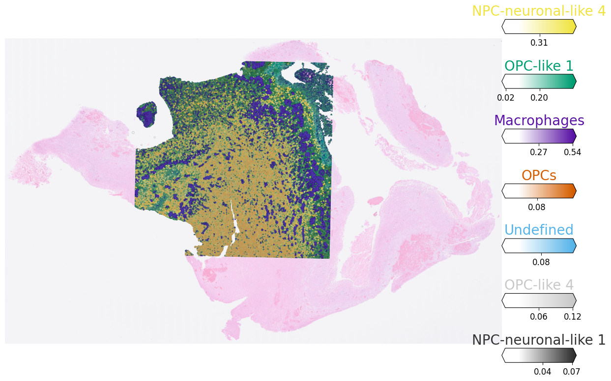
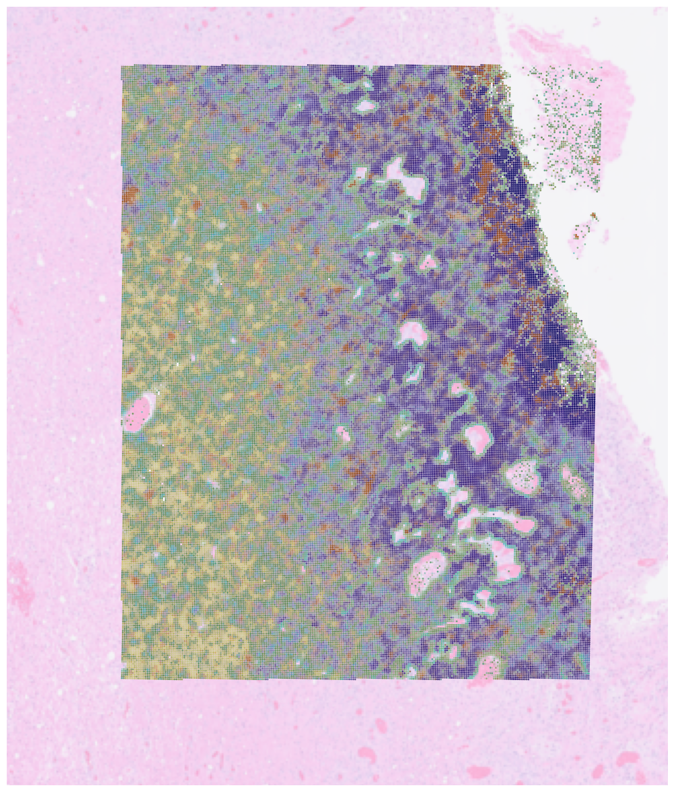

# Visium HD tips and tricks
 Generally, the workflow for Visium HD data is almost identical to normal Visium data. However, there are some differences that you should be aware of. This tutorial will guide you through the main differences and how to handle them.

 ## Data loading

 As of now, there is no specific `scanpy` function for reading Visium HD data. However, you can use the `scanpy.read_visium` function to load the data, if you change the format of `tissue_position_list` file in `{sample}/binned_outputs/square_008um/` folder:

 ```python
pd.read_parquet(visium_path+'spatial/tissue_positions.parquet').to_csv(visium_path+'spatial/tissue_positions_list.csv', index = False)
```

After that, you can load the data as follows:

```python
visium = sc.read_visium(visium_path, genome=None, count_file='filtered_feature_bc_matrix.h5',
                    library_id=None, load_images=True, source_image_path=None)
visium.var_names_make_unique()
coor_int = [[float(x[0]),float(x[1])] for x in visium.obsm["spatial"]]
visium.obsm["spatial"] = np.array(coor_int)
```
In principal, you can also use a different resolutiion than 8um, but you need to change the `square_008um` part of the path to the desired resolution and that is the only resolution we have tested so far.

After loading the data you might want to run the standard visium preprocessing steps such as filtering.

## Model training and prediction

When training a model on Visium HD data you might need a larger model than shown in the [Visium tutorial](tutorials/cell-state-clone-mapping.md). E.g:
```python
lr = 1e-3
hid_dim = 300
head = 1
wd = 0.01
```

Additionally, for prediction step you might want to move the data to CPU first:
```
model = model.cpu()
```
Or consider using batch predictions.

## Visualization

When visualizing the results, you can use standard `scanpy` functions. However, you might want to use a larger figure size for the spatial plots, e.g.:
```python
from spaceTree.plot_spatial import *
    with mpl.rc_context({'figure.figsize': (15, 15)}):
        fig = plot_spatial(
            adata=visium,
            # labels to show on a plot
            color=top, labels=top,
            show_img=True,
            # 'fast' (white background) or 'dark_background'
            style='fast',
            # limit color scale at 99.2% quantile of cell abundance
            max_color_quantile=0.992,
            # size of locations (adjust depending on figure size)
            circle_diameter=0.5,
            colorbar_position='right',
            img_alpha = 0.5
        )
    plt.show()
```
<div style="text-align: left;">
  
</div>
This will allow you to see the spatial distribution and mixing more clearly as well as allow you to zoom-in in the areas of interest:

```{python}
with mpl.rc_context({'figure.figsize': (15, 15)}):
    fig = plot_spatial(
        adata=visium_small,
        # labels to show on a plot
        color=top_small, labels=top_small,
        show_img=True,
        # 'fast' (white background) or 'dark_background'
        style='fast',
        # limit color scale at 99.2% quantile of cell abundance
        max_color_quantile=0.992,
        # size of locations (adjust depending on figure size)
        circle_diameter=1,
        colorbar_position=None,
        img_alpha = 0.5,
        crop_x = (1010,1350),
        crop_y = (300,700),
    )
plt.show()
```

<div style="text-align: left;">
  
</div>

Function `plot_spatial` was initially developed as a part of [cell2location](https://cell2location.readthedocs.io/en/latest/) package and was adapted for spaceTree. It allows you to plot overlapping spatial distributions of cell types on top of the Visium image. 